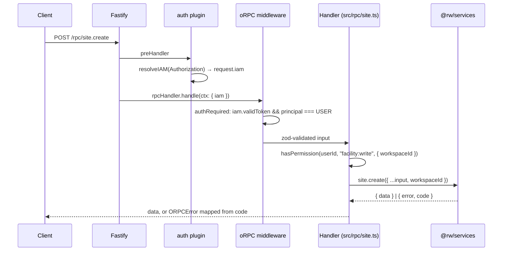

export const metadata = {
  title: 'API Server',
  description: 'How apps/api boots, serves REST + oRPC, and what runs inside its process.',
}

# API Server

`apps/api` is the platform's HTTP surface: REST routes, the oRPC router, the gateway edge protocol, and a handful of light in-process workers. It is stateless and scales horizontally. {{ className: 'lead' }}

## Boot sequence

Entry point is `apps/api/src/main.ts` (heavily commented — read it first). Order matters:

1. `createPrismaClient("api")` — role-sized connection pool
2. Driver registry initialization — loads driver definitions from files and upserts to the DB (safe under multiple instances; name+version is the unique key)
3. **HTTP server starts first** (`src/server.ts`) so health checks and RPC respond while the rest registers
4. Events bridge (`initEventsBridge("both")`) and metrics bridge — Redis pub/sub so SSE clients on *any* api machine see events published by workers or by other api machines
5. Graph-definition publisher, entity-event publisher, command bus — the NATS/JetStream publishers (`src/graph-definition-publisher.ts`, `src/entity-event-publisher.ts`, `src/command-bus.ts`)
6. Producer-side queue inits (metric buckets, station detection) — `Queue` instances RPC handlers enqueue against; most consumers live in `apps/workers`
7. In-process workers: `stale-gateway-check` (30s repeating), station-detect (slow/down, producer **and** consumer here), `replay-reconcile` + `recoverReplayWindows()` on boot

The header comment in `main.ts` is the authoritative list of what runs in-process vs in `apps/workers` — keep it current when moving workers.

## Server composition

`src/server.ts` registers, in order: CORS → sensible → rate limit → swagger → **auth plugin** (populates `request.iam` via preHandler) → admin REST routes (`src/api/`) → edge routes (`src/edge.ts`, gateway protocol) → the oRPC handler mounted at `/rpc/*` with error interceptors.

Config lives in `src/config.ts` — env-driven; API listens on port 30000 by default (livestore 30100, docs 30200).

## The two API styles

- **REST** (`src/api/`) — auth/session endpoints, users, workspaces, sites, etc. JSON-Schema-validated via the Fastify type provider; feeds the generated OpenAPI spec (`pnpm openapi:generate`) and the published `@rockwarehq/api-client`.
- **oRPC** (`src/rpc/`) — the main application API, ~40 domain routers (site, station, workcenter, employee, job, inventory, automations, graph, …) composed in `src/rpc/index.ts`. Type-safe end-to-end; consumed via `packages/rpc-client`.

## Request lifecycle (oRPC)

Representative trace for `site.create`:

## Conventions

- **Service results, not exceptions**: services return `{ data }` or `{ error, code }`. RPC handlers unwrap and map codes (`NOT_FOUND`, `EXISTS`, `MISMATCH`, …) to `ORPCError` statuses. Unhandled throws hit the oRPC interceptor in `server.ts`, get logged, and return 500.
- **Validation**: Zod for RPC inputs; JSON Schema for REST responses; AJV for driver-defined datasource/point config.
- **Scoping**: handlers read `workspaceId`/`siteId` from `context.iam` and pass them into services explicitly — services never trust client-supplied scope.
- **Permissions**: `hasPermission(userId, "resource:action", { workspaceId, siteId? })` from `@rw/auth` — check at the top of any mutating handler.

## Automations wiring

`packages/automations` is the generic rules-engine framework (event schemas → json-rules-engine conditions → versioned action handlers, with run audit records). `apps/api/src/automations/` wires it to this app: event schemas + context builders (`events/`), action handlers (`actions/`, e.g. `send-alert`), and ref sources for UI dropdowns. The RPC surface (`src/rpc/automations.ts`) exposes the catalog and CRUD.

## Edge routes

`src/edge.ts` is the gateway-facing protocol (claim, connect, token validation with `safeEqual`). Covered in [Edge & Data Pipeline](/internal/architecture/edge).
