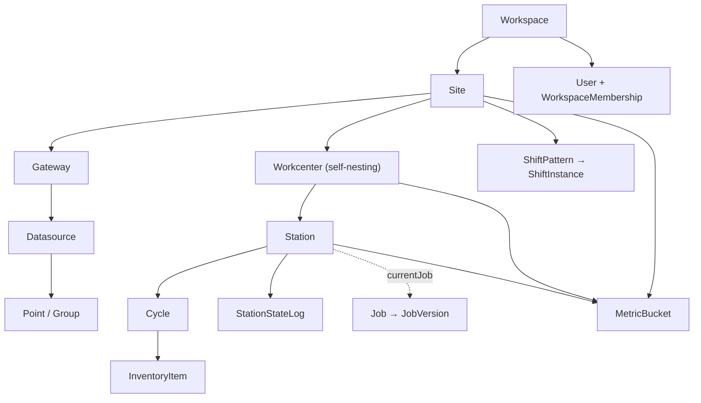

export const metadata = {
  title: 'Data Model & Metrics',
  description: 'Schema domains, tenancy scoping, versioning conventions, and how OEE is computed.',
}

# Data Model & Metrics

The Prisma schema is split across ~24 domain files in `packages/db/schema/`. This page gives you the mental model: the entity hierarchy, the conventions every domain follows, and the metric/OEE design. {{ className: 'lead' }}

## Entity hierarchy

- **Workspace** = tenant boundary; **Site** = physical facility. Everything below hangs off `siteId` (workspace scoping is implicit via Site). The asset tree (Site → Workcenter → Station) follows ISA-95.
- **Gateway → Datasource → Point** models the edge: which device, which protocol connection, which tags.
- **Cycle** is the atom of production: one unit of work at a station (`start`/`end`, `CycleStatus: GOOD|BAD|DISCARD`, snapshots of the job/station config in effect).
- **Shifts**: `ShiftPattern` (reusable rotation template) → `ShiftAssignment` (pattern frozen onto a site/workcenter) → `ShiftInstance` (materialized concrete windows with pre-computed `businessDate`).

Other domains: `iam` (roles/assignments), `api-token`, `audit`, `automation`, `dashboard`, `display`, `document` (+ S3-backed uploads and `DocumentLink`), `employee`, `entity` (user-defined object schemas with JSONB values, GIN-indexed), `graph` (livestore config), `inventory`, `job`, `andon`, `workorder`, `location`.

## Conventions (follow these in new schema work)

- **Soft delete, three flavors**: `deletedAt DateTime?` on operational entities, `archivedAt` on versioned catalog entities (job/tool/product), `isDeleted Boolean` on graph/entity/document rows. Always filter in queries.
- **Version snapshots**: config that affects historical interpretation is snapshotted — `StationVersion`, `JobVersion`, `ToolVersion` — and cycles reference the version ids in effect at the time. Historical queries must read the version, not current config.
- **`attrs Json` escape hatch** on most entities for customer-specific fields without migrations; user-defined types go through `ObjectSchema`/`ObjectInstance` (JSONB).
- **Audit**: security-relevant actions write `AuditLog` rows (action enum, target user, actor, IP, user agent, metadata).

## Database client

`createPrismaClient(role)` (`packages/db/src/client.ts`) sizes the pool per process role (api, rollups, livestore, imm-events, …) so a tenant's total connection budget is deliberate. Rollups uses a direct (non-pgbouncer) endpoint for its long CTEs. `classifyDbTimeout()` (`src/timeouts.ts`) distinguishes statement/lock/idle-transaction timeouts for greppable logging and 503 mapping.

## Metric buckets

`MetricBucket` (`packages/db/schema/metric.prisma`) is the time-sliced aggregate that powers every KPI:

- **Keyed by** `(entityType, entityId, granularity, startTime)` — entity is STATION, WORKCENTER, SITE, or JOB; granularity is MINUTE, HOUR, SHIFT, or DAY.
- **Shift-aware**: HOUR/SHIFT buckets link a `ShiftInstance` and carry `businessDate`/`businessShift`, so "yesterday's night shift" is an indexed query, not timezone math.
- **Raw counters** are written by ingestion and the rollups worker: cycle/item counts (total/bad), expected counts, run/down/planned-down seconds, ideal and total cycle seconds, plus `elapsed*` variants that make in-progress buckets rate-correct.
- Old buckets archive to `MetricBucketLog` (identical shape, ratios frozen at archive time).

## OEE — computed in Postgres

The ratios are **generated columns** (`GENERATED ALWAYS AS`), so they can never drift from the counters:

| Column | Formula |
| --- | --- |
| `availability` | `runSeconds / elapsedPlannedProductionSeconds` |
| `performance` | `idealCycleSeconds / runSeconds` |
| `quality` | `goodItems / totalItems` |
| `oee` | `(idealCycleSeconds × goodItems) / (elapsedPlannedProductionSeconds × totalItems)` |

All null-safe (null when there's no production window). Because the inputs are **additive**, rollup up the hierarchy is just summing child counters — the generated columns re-derive correct ratios at every level. The orchestration (ensure/rollup/recalc/archive/sync) lives in `packages/services/src/metrics/` — `compute.ts` is the pure, idempotent core; `sync.ts` publishes changes to NATS for livestore `metric` properties.
