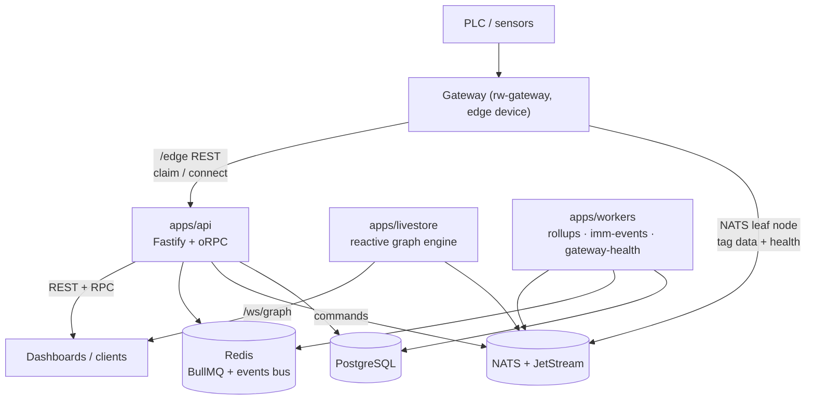

export const metadata = {
  title: 'System Overview',
  description: 'What rw-server is, its deployables, and how data moves through the platform.',
}

# System Overview

Rockware is a multi-tenant industrial manufacturing platform: it connects factory-floor equipment (via edge gateways) to live dashboards, production metrics (OEE), and event-driven automations. {{ className: 'lead' }}

This page is the map. Each subsystem has its own deep-dive:

- [API Server](/internal/architecture/api) — Fastify + oRPC, request lifecycle, RPC conventions
- [Auth & IAM](/internal/architecture/auth) — tokens, principals, RBAC
- [Edge & Data Pipeline](/internal/architecture/edge) — gateways, NATS, how a machine cycle becomes a database row
- [Background Work](/internal/architecture/workers) — the workers binary, job inventory, scaling rules
- [Livestore](/internal/architecture/livestore) — the reactive graph engine behind live dashboards
- [Data Model & Metrics](/internal/architecture/data-model) — schema domains, tenancy scoping, OEE math

## The big picture

## Deployables

| App | Purpose | Scaling |
| --- | --- | --- |
| `apps/api` | HTTP/RPC surface, auth, edge protocol, light in-process workers | Horizontal (stateless) |
| `apps/workers` | Single binary, mode per process: `--worker rollups \| imm-events \| gateway-health` | Per-mode; **rollups must stay at 1** |
| `apps/livestore` | Reactive graph engine + `/ws/graph` websocket gateway | Single machine per tenant (HA deferred) |
| `apps/docs` | This site | — |

Deployment is **per-tenant**: each tenant (e.g. `sim`, `dixie`, `dev`) gets its own fly.io app pair plus its own Postgres/Redis/NATS. `scripts/fly-deploy.ts` merges `fly/base.toml` with `apps/*/fly/tenants/<tenant>.toml`, validates required secrets, and deploys. Migrations run as the API app's `release_command`.

## Shared packages

| Package | What it provides |
| --- | --- |
| `packages/db` | Prisma schema (split across ~24 domain files in `schema/`), `createPrismaClient(role)` with per-role pool sizing, `classifyDbTimeout()` |
| `packages/runtime` | Events bus (Redis pub/sub bridge), BullMQ factories, http-host (`/healthz`, `/readyz`, `/metrics`), lifecycle/drain, gateway NATS subjects |
| `packages/services` | Business logic by domain (facility, cycle, metrics, document, entity, queues, …) — the layer RPC handlers call into |
| `packages/auth` | Token create/verify, IAM context, RBAC, API tokens, timing-safe secret helpers |
| `packages/livestore` | The graph engine implementation + event catalog (see its `spec.md`) |
| `packages/automations` | Generic rules-engine framework (events → conditions → actions) |
| `packages/metrics` | OEE calculation functions |
| `packages/rpc-client`, `packages/api-client` | Published clients (oRPC-typed and OpenAPI-generated) |

## Tenancy model

Two layers:

1. **Per-tenant deployment** — each customer environment is its own fly app pair + database. There is no cross-tenant traffic.
2. **Workspace → Site scoping inside a deployment** — `Workspace` is the tenant boundary in the schema; `Site` is a physical facility under it. Nearly every domain row hangs off a `siteId`. Auth tokens embed `workspaceId` (+ optional `siteId`), and services filter queries by them. See [Data Model](/internal/architecture/data-model) and [Auth & IAM](/internal/architecture/auth).

## Infrastructure roles

- **PostgreSQL** — system of record. OEE ratios are Postgres *generated columns* on `MetricBucket`.
- **Redis** — BullMQ job queues + the events bus (ephemeral fan-out between processes, e.g. SSE nudges). `REDIS_URL` must be identical across a tenant's api and workers apps.
- **NATS + JetStream** — everything edge and reactive: gateway leaf-node connections, tag data, gateway health, durable command delivery to gateways, entity/metric change feeds, livestore hook events, and the KV buckets holding current graph values.

## Tech stack

Node.js ≥ 24, TypeScript, Fastify 5, oRPC, Prisma 7 (Postgres), BullMQ (Redis), NATS JetStream, Zod validation, Biome for lint/format, pnpm workspace monorepo.
