# Data Model ERD & Audit

Crow's-foot ER diagrams for all ~100 models in `packages/db/schema/`, one diagram per domain, followed by [audit findings](#audit-findings) collected while mapping the schema. Built for reviewing the data model as a whole — not just what the database enforces, but what it silently doesn't.

## How to read these diagrams

- **Solid line** — a real foreign key enforced by Postgres.
- **Dashed line** — a *soft reference*: an id column with **no FK constraint** (polymorphic columns, loose audit ids, string keys). Every dashed line is an audit target — nothing stops these ids from dangling.
- **Crow's foot cardinality** — `||` exactly one, `|o` zero or one, `o{` zero or more.
- Relationship labels note the `onDelete` behavior only where it's surprising (Restrict, SetNull, or a missing Cascade on a hot path).
- **Attributes are deliberately incomplete.** Each entity shows its PK, FK and soft-ref columns, unique/discriminator columns, and its soft-delete column. Full column lists live in the Prisma files — each section links its source file. Entities drawn without attributes are stubs owned by another section; a stub's own relationships (e.g. its Site ownership) are drawn only in its home diagram.
- Polymorphic soft refs (`MetricBucket.entityId`, `DocumentLink.targetId`) are drawn `..o|` toward *each* possible target even though the column itself is required — per row, only the one target matching the type discriminator applies.

## Overview — core entities

The condensed core: tenancy, the ISA-95 asset tree, production, and the two parallel read/compute models (MetricBucket, graph).

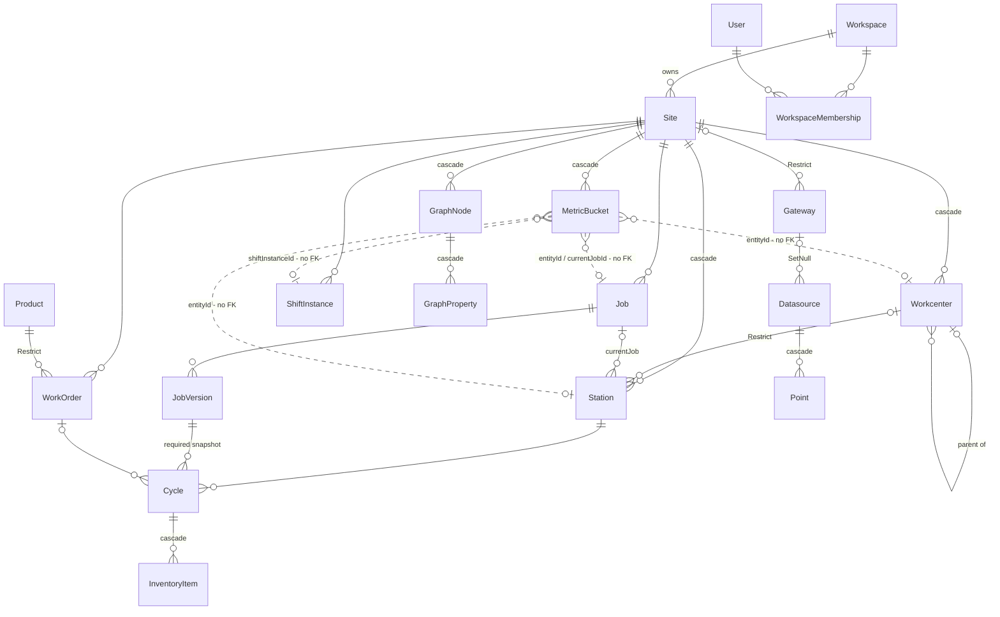
```mermaid
erDiagram
  Workspace ||--o{ Site : "owns"
  Workspace ||--o{ WorkspaceMembership : ""
  User ||--o{ WorkspaceMembership : ""
  Site ||--o{ Workcenter : "cascade"
  Workcenter |o--o{ Workcenter : "parent of"
  Site ||--o{ Station : "cascade"
  Workcenter |o--o{ Station : "Restrict"
  Job |o--o{ Station : "currentJob"
  Job ||--o{ JobVersion : ""
  Site ||--o{ Job : ""
  Station ||--o{ Cycle : ""
  JobVersion ||--o{ Cycle : "required snapshot"
  WorkOrder |o--o{ Cycle : ""
  Site ||--o{ WorkOrder : ""
  Product ||--o{ WorkOrder : "Restrict"
  Cycle ||--o{ InventoryItem : "cascade"
  Site ||--o{ ShiftInstance : ""
  Site ||--o{ MetricBucket : "cascade"
  MetricBucket }o..o| Station : "entityId - no FK"
  MetricBucket }o..o| Workcenter : "entityId - no FK"
  MetricBucket }o..o| Job : "entityId / currentJobId - no FK"
  MetricBucket }o..o| ShiftInstance : "shiftInstanceId - no FK"
  Site ||--o{ GraphNode : "cascade"
  GraphNode ||--o{ GraphProperty : "cascade"
  Site |o--o{ Gateway : "Restrict"
  Gateway |o--o{ Datasource : "SetNull"
  Datasource ||--o{ Point : "cascade"
```

## Tenancy & IAM

Source: `packages/db/schema/workspace.prisma`, `user.prisma`, `iam.prisma`, `api-token.prisma`, `audit.prisma`, `location.prisma`.

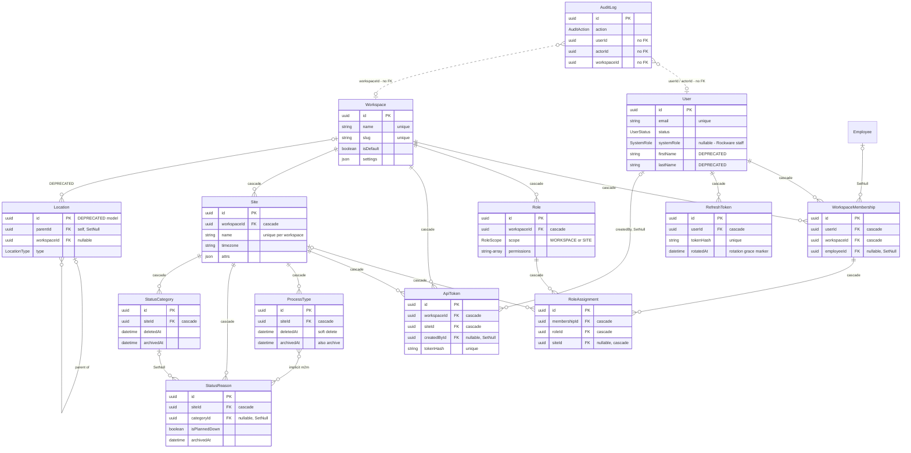
```mermaid
erDiagram
  Workspace {
    uuid id PK
    string name "unique"
    string slug "unique"
    boolean isDefault
    json settings
  }
  User {
    uuid id PK
    string email "unique"
    UserStatus status
    SystemRole systemRole "nullable - Rockware staff"
    string firstName "DEPRECATED"
    string lastName "DEPRECATED"
  }
  WorkspaceMembership {
    uuid id PK
    uuid userId FK "cascade"
    uuid workspaceId FK "cascade"
    uuid employeeId FK "nullable, SetNull"
  }
  RefreshToken {
    uuid id PK
    uuid userId FK "cascade"
    string tokenHash "unique"
    datetime rotatedAt "rotation grace marker"
  }
  Role {
    uuid id PK
    uuid workspaceId FK "cascade"
    RoleScope scope "WORKSPACE or SITE"
    string-array permissions
  }
  RoleAssignment {
    uuid id PK
    uuid membershipId FK "cascade"
    uuid roleId FK "cascade"
    uuid siteId FK "nullable, cascade"
  }
  ApiToken {
    uuid id PK
    uuid workspaceId FK "cascade"
    uuid siteId FK "cascade"
    uuid createdById FK "nullable, SetNull"
    string tokenHash "unique"
  }
  AuditLog {
    uuid id PK
    AuditAction action
    uuid userId "no FK"
    uuid actorId "no FK"
    uuid workspaceId "no FK"
  }
  Site {
    uuid id PK
    uuid workspaceId FK "cascade"
    string name "unique per workspace"
    string timezone
    json attrs
  }
  ProcessType {
    uuid id PK
    uuid siteId FK "cascade"
    datetime deletedAt "soft delete"
    datetime archivedAt "also archive"
  }
  StatusReason {
    uuid id PK
    uuid siteId FK "cascade"
    uuid categoryId FK "nullable, SetNull"
    boolean isPlannedDown
    datetime archivedAt
  }
  StatusCategory {
    uuid id PK
    uuid siteId FK "cascade"
    datetime deletedAt
    datetime archivedAt
  }
  Location {
    uuid id PK "DEPRECATED model"
    uuid parentId FK "self, SetNull"
    uuid workspaceId FK "nullable"
    LocationType type
  }

  Workspace ||--o{ WorkspaceMembership : "cascade"
  User ||--o{ WorkspaceMembership : "cascade"
  Employee |o--o{ WorkspaceMembership : "SetNull"
  User ||--o{ RefreshToken : "cascade"
  Workspace ||--o{ Role : "cascade"
  WorkspaceMembership ||--o{ RoleAssignment : "cascade"
  Role ||--o{ RoleAssignment : "cascade"
  Site |o--o{ RoleAssignment : "cascade"
  Workspace ||--o{ ApiToken : "cascade"
  Site ||--o{ ApiToken : "cascade"
  User |o--o{ ApiToken : "createdBy, SetNull"
  AuditLog }o..o| User : "userId / actorId - no FK"
  AuditLog }o..o| Workspace : "workspaceId - no FK"
  Workspace ||--o{ Site : "cascade"
  Site ||--o{ ProcessType : "cascade"
  Site ||--o{ StatusReason : "cascade"
  Site ||--o{ StatusCategory : "cascade"
  StatusCategory |o--o{ StatusReason : "SetNull"
  ProcessType }o--o{ StatusReason : "implicit m2m"
  Workspace |o--o{ Location : "DEPRECATED"
  Location |o--o{ Location : "parent of"
```

- `User.systemRole` marks internal Rockware staff whose permissions resolve from code; the no-membership rule is enforced in the service layer, not the schema.
- `AuditLog` has **no FK constraints at all** — ids are retained even if the user/workspace is deleted. Intentional for audit trails, but nothing validates them at write time.

## Asset hierarchy

Source: `packages/db/schema/workcenter.prisma`.

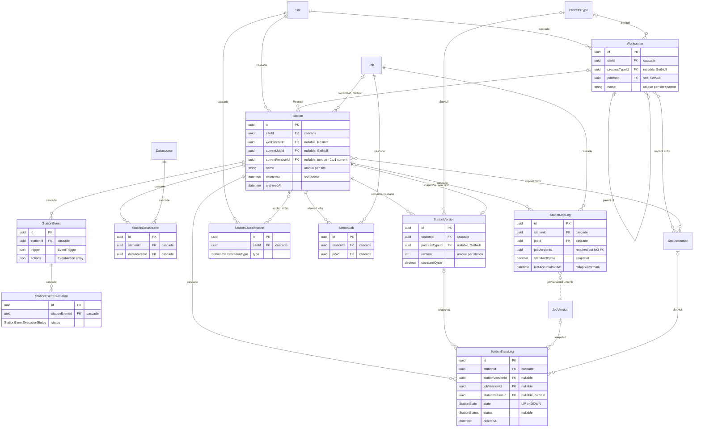
```mermaid
erDiagram
  Workcenter {
    uuid id PK
    uuid siteId FK "cascade"
    uuid processTypeId FK "nullable, SetNull"
    uuid parentId FK "self, SetNull"
    string name "unique per site+parent"
  }
  Station {
    uuid id PK
    uuid siteId FK "cascade"
    uuid workcenterId FK "nullable, Restrict"
    uuid currentJobId FK "nullable, SetNull"
    uuid currentVersionId FK "nullable, unique - 1to1 current"
    string name "unique per site"
    datetime deletedAt "soft delete"
    datetime archivedAt
  }
  StationVersion {
    uuid id PK
    uuid stationId FK "cascade"
    uuid processTypeId FK "nullable, SetNull"
    int version "unique per station"
    decimal standardCycle
  }
  StationStateLog {
    uuid id PK
    uuid stationId FK "cascade"
    uuid stationVersionId FK "nullable"
    uuid jobVersionId FK "nullable"
    uuid statusReasonId FK "nullable, SetNull"
    StationState state "UP or DOWN"
    StationStatus status "nullable"
    datetime deletedAt
  }
  StationDatasource {
    uuid id PK
    uuid stationId FK "cascade"
    uuid datasourceId FK "cascade"
  }
  StationEvent {
    uuid id PK
    uuid stationId FK "cascade"
    json trigger "EventTrigger"
    json actions "EventAction array"
  }
  StationEventExecution {
    uuid id PK
    uuid stationEventId FK "cascade"
    StationEventExecutionStatus status
  }
  StationClassification {
    uuid id PK
    uuid siteId FK "cascade"
    StationClassificationType type
  }
  StationJob {
    uuid id PK
    uuid stationId FK "cascade"
    uuid jobId FK "cascade"
  }
  StationJobLog {
    uuid id PK
    uuid stationId FK "cascade"
    uuid jobId FK "cascade"
    uuid jobVersionId "required but NO FK"
    decimal standardCycle "snapshot"
    datetime lastAccumulatedAt "rollup watermark"
  }

  Site ||--o{ Workcenter : "cascade"
  ProcessType |o--o{ Workcenter : "SetNull"
  Workcenter |o--o{ Workcenter : "parent of"
  Site ||--o{ Station : "cascade"
  Workcenter |o--o{ Station : "Restrict"
  Job |o--o{ Station : "currentJob, SetNull"
  StationVersion |o--o| Station : "currentVersion 1to1"
  Station ||--o{ StationVersion : "versions, cascade"
  ProcessType |o--o{ StationVersion : "SetNull"
  Station ||--o{ StationStateLog : "cascade"
  StationVersion |o--o{ StationStateLog : "snapshot"
  JobVersion |o--o{ StationStateLog : "snapshot"
  StatusReason |o--o{ StationStateLog : "SetNull"
  Station ||--o{ StationDatasource : "cascade"
  Datasource ||--o{ StationDatasource : "cascade"
  Station ||--o{ StationEvent : "cascade"
  StationEvent ||--o{ StationEventExecution : "cascade"
  Site ||--o{ StationClassification : "cascade"
  Station }o--o{ StationClassification : "implicit m2m"
  Station ||--o{ StationJob : "allowed jobs"
  Job ||--o{ StationJob : "cascade"
  Station ||--o{ StationJobLog : "cascade"
  Job ||--o{ StationJobLog : "cascade"
  StationJobLog }o..|| JobVersion : "jobVersionId - no FK"
  Workcenter }o--o{ StatusReason : "implicit m2m"
  Station }o--o{ StatusReason : "implicit m2m"
```

- `StationJobLog.jobVersionId` is **required yet has no FK**. Other required no-FK ids exist (`MetricBucket.entityId`, `DocumentLink.targetId`, the automation run ids), but those are polymorphic or deliberately orphan-tolerant — this one has exactly one obvious target table and could simply be a real FK.
- Station is one of the version-snapshot entities: the `currentVersionId` unique FK plus the `versions` back-relation forms a **circular FK pair** (see [findings](#audit-findings)).

## Job & Tool

Source: `packages/db/schema/job.prisma`.

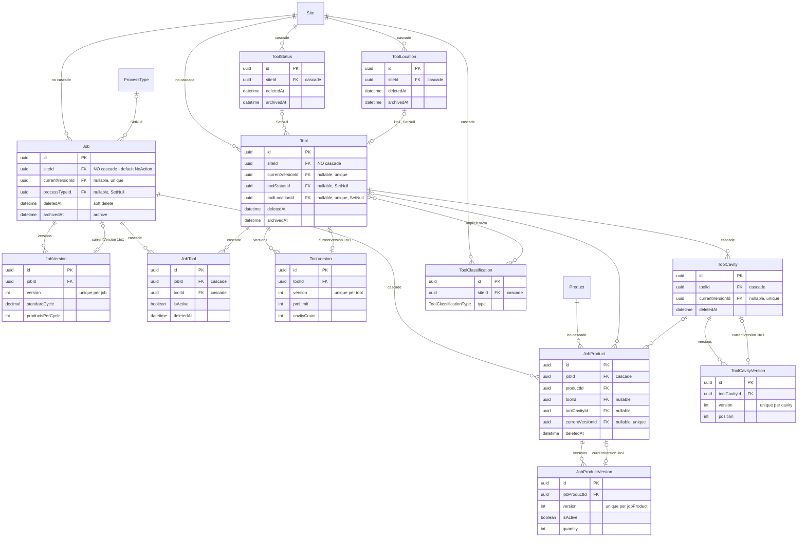
```mermaid
erDiagram
  Job {
    uuid id PK
    uuid siteId FK "NO cascade - default NoAction"
    uuid currentVersionId FK "nullable, unique"
    uuid processTypeId FK "nullable, SetNull"
    datetime deletedAt "soft delete"
    datetime archivedAt "archive"
  }
  JobVersion {
    uuid id PK
    uuid jobId FK
    int version "unique per job"
    decimal standardCycle
    int productsPerCycle
  }
  JobTool {
    uuid id PK
    uuid jobId FK "cascade"
    uuid toolId FK "cascade"
    boolean isActive
    datetime deletedAt
  }
  JobProduct {
    uuid id PK
    uuid jobId FK "cascade"
    uuid productId FK
    uuid toolId FK "nullable"
    uuid toolCavityId FK "nullable"
    uuid currentVersionId FK "nullable, unique"
    datetime deletedAt
  }
  JobProductVersion {
    uuid id PK
    uuid jobProductId FK
    int version "unique per jobProduct"
    boolean isActive
    int quantity
  }
  Tool {
    uuid id PK
    uuid siteId FK "NO cascade"
    uuid currentVersionId FK "nullable, unique"
    uuid toolStatusId FK "nullable, SetNull"
    uuid toolLocationId FK "nullable, unique, SetNull"
    datetime deletedAt
    datetime archivedAt
  }
  ToolVersion {
    uuid id PK
    uuid toolId FK
    int version "unique per tool"
    int pmLimit
    int cavityCount
  }
  ToolCavity {
    uuid id PK
    uuid toolId FK "cascade"
    uuid currentVersionId FK "nullable, unique"
    datetime deletedAt
  }
  ToolCavityVersion {
    uuid id PK
    uuid toolCavityId FK
    int version "unique per cavity"
    int position
  }
  ToolStatus {
    uuid id PK
    uuid siteId FK "cascade"
    datetime deletedAt
    datetime archivedAt
  }
  ToolClassification {
    uuid id PK
    uuid siteId FK "cascade"
    ToolClassificationType type
  }
  ToolLocation {
    uuid id PK
    uuid siteId FK "cascade"
    datetime deletedAt
    datetime archivedAt
  }

  Site ||--o{ Job : "no cascade"
  ProcessType |o--o{ Job : "SetNull"
  JobVersion |o--o| Job : "currentVersion 1to1"
  Job ||--o{ JobVersion : "versions"
  Site ||--o{ Tool : "no cascade"
  ToolStatus |o--o{ Tool : "SetNull"
  ToolLocation |o--o| Tool : "1to1, SetNull"
  ToolVersion |o--o| Tool : "currentVersion 1to1"
  Tool ||--o{ ToolVersion : "versions"
  Tool ||--o{ ToolCavity : "cascade"
  ToolCavityVersion |o--o| ToolCavity : "currentVersion 1to1"
  ToolCavity ||--o{ ToolCavityVersion : "versions"
  Site ||--o{ ToolStatus : "cascade"
  Site ||--o{ ToolClassification : "cascade"
  Site ||--o{ ToolLocation : "cascade"
  Tool }o--o{ ToolClassification : "implicit m2m"
  Job ||--o{ JobTool : "cascade"
  Tool ||--o{ JobTool : "cascade"
  Job ||--o{ JobProduct : "cascade"
  Product ||--o{ JobProduct : "no cascade"
  Tool |o--o{ JobProduct : ""
  ToolCavity |o--o{ JobProduct : ""
  JobProductVersion |o--o| JobProduct : "currentVersion 1to1"
  JobProduct ||--o{ JobProductVersion : "versions"
```

## Production

Source: `packages/db/schema/cycle.prisma`, `workorder.prisma`.

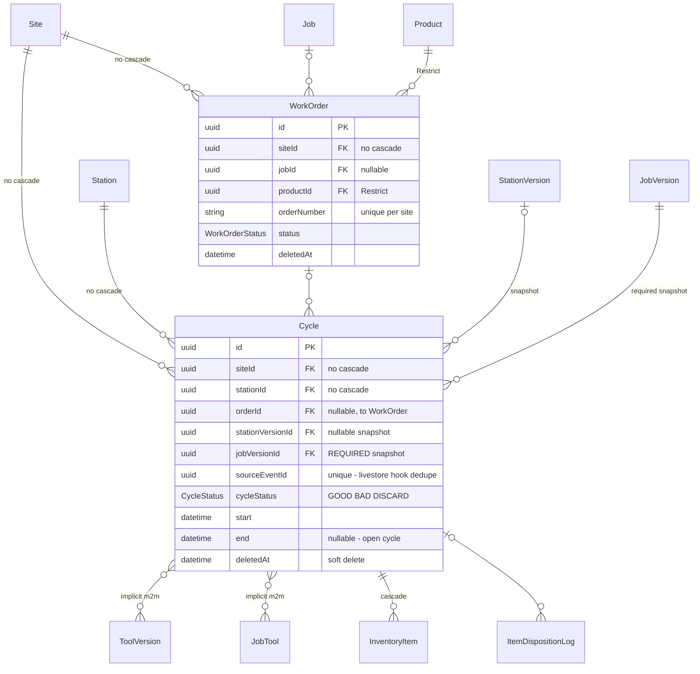
```mermaid
erDiagram
  Cycle {
    uuid id PK
    uuid siteId FK "no cascade"
    uuid stationId FK "no cascade"
    uuid orderId FK "nullable, to WorkOrder"
    uuid stationVersionId FK "nullable snapshot"
    uuid jobVersionId FK "REQUIRED snapshot"
    uuid sourceEventId "unique - livestore hook dedupe"
    CycleStatus cycleStatus "GOOD BAD DISCARD"
    datetime start
    datetime end "nullable - open cycle"
    datetime deletedAt "soft delete"
  }
  WorkOrder {
    uuid id PK
    uuid siteId FK "no cascade"
    uuid jobId FK "nullable"
    uuid productId FK "Restrict"
    string orderNumber "unique per site"
    WorkOrderStatus status
    datetime deletedAt
  }

  Site ||--o{ Cycle : "no cascade"
  Station ||--o{ Cycle : "no cascade"
  WorkOrder |o--o{ Cycle : ""
  StationVersion |o--o{ Cycle : "snapshot"
  JobVersion ||--o{ Cycle : "required snapshot"
  Cycle }o--o{ ToolVersion : "implicit m2m"
  Cycle }o--o{ JobTool : "implicit m2m"
  Cycle ||--o{ InventoryItem : "cascade"
  Cycle |o--o{ ItemDispositionLog : ""
  Site ||--o{ WorkOrder : "no cascade"
  Job |o--o{ WorkOrder : ""
  Product ||--o{ WorkOrder : "Restrict"
```

- `Cycle.orderId` points at **WorkOrder** (production), *not* the fulfillment `Order` in the inventory domain. The two order concepts are unrelated tables — see [findings](#audit-findings).
- `Cycle.jobVersionId` is required while `stationVersionId` is optional — an inconsistency in the snapshot pattern.
- `sourceEventId @unique` is the idempotency key for cycles created from LiveStore hook events (at-least-once delivery).

## Inventory, Orders & Materials

Source: `packages/db/schema/inventory.prisma` — the densest domain, split into four diagrams.

### Fulfillment orders

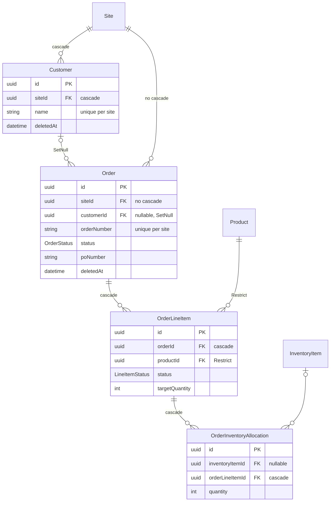
```mermaid
erDiagram
  Customer {
    uuid id PK
    uuid siteId FK "cascade"
    string name "unique per site"
    datetime deletedAt
  }
  Order {
    uuid id PK
    uuid siteId FK "no cascade"
    uuid customerId FK "nullable, SetNull"
    string orderNumber "unique per site"
    OrderStatus status
    string poNumber
    datetime deletedAt
  }
  OrderLineItem {
    uuid id PK
    uuid orderId FK "cascade"
    uuid productId FK "Restrict"
    LineItemStatus status
    int targetQuantity
  }
  OrderInventoryAllocation {
    uuid id PK
    uuid inventoryItemId FK "nullable"
    uuid orderLineItemId FK "cascade"
    int quantity
  }

  Site ||--o{ Customer : "cascade"
  Customer |o--o{ Order : "SetNull"
  Site ||--o{ Order : "no cascade"
  Order ||--o{ OrderLineItem : "cascade"
  Product ||--o{ OrderLineItem : "Restrict"
  OrderLineItem ||--o{ OrderInventoryAllocation : "cascade"
  InventoryItem |o--o{ OrderInventoryAllocation : ""
```

### Products & materials

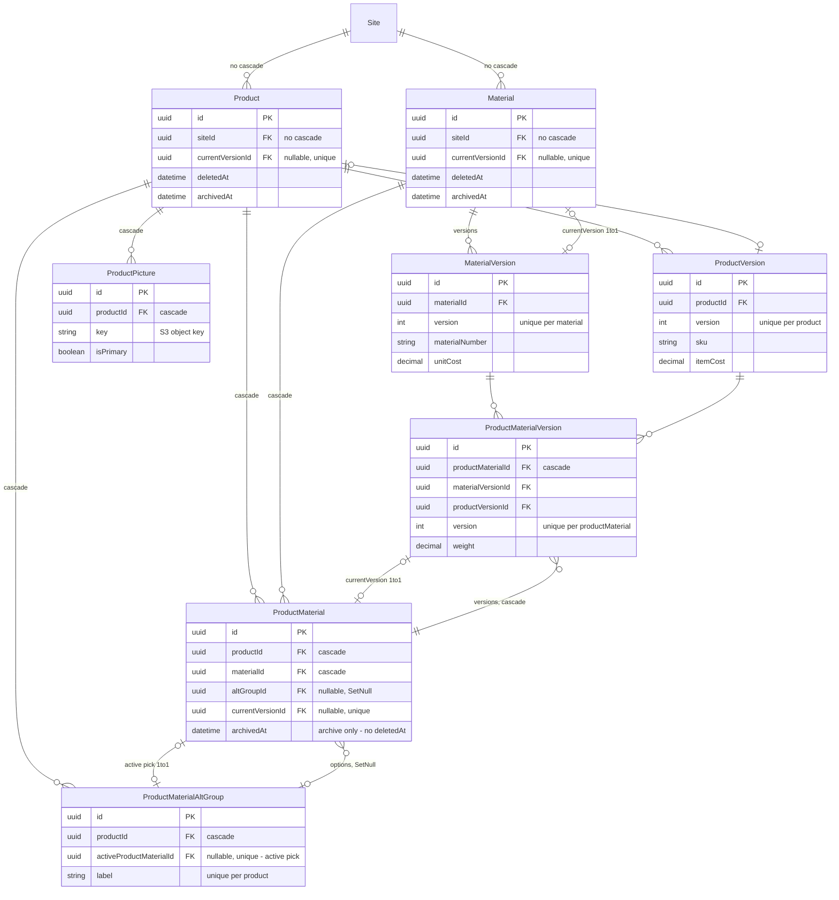
```mermaid
erDiagram
  Product {
    uuid id PK
    uuid siteId FK "no cascade"
    uuid currentVersionId FK "nullable, unique"
    datetime deletedAt
    datetime archivedAt
  }
  ProductVersion {
    uuid id PK
    uuid productId FK
    int version "unique per product"
    string sku
    decimal itemCost
  }
  ProductPicture {
    uuid id PK
    uuid productId FK "cascade"
    string key "S3 object key"
    boolean isPrimary
  }
  Material {
    uuid id PK
    uuid siteId FK "no cascade"
    uuid currentVersionId FK "nullable, unique"
    datetime deletedAt
    datetime archivedAt
  }
  MaterialVersion {
    uuid id PK
    uuid materialId FK
    int version "unique per material"
    string materialNumber
    decimal unitCost
  }
  ProductMaterialAltGroup {
    uuid id PK
    uuid productId FK "cascade"
    uuid activeProductMaterialId FK "nullable, unique - active pick"
    string label "unique per product"
  }
  ProductMaterial {
    uuid id PK
    uuid productId FK "cascade"
    uuid materialId FK "cascade"
    uuid altGroupId FK "nullable, SetNull"
    uuid currentVersionId FK "nullable, unique"
    datetime archivedAt "archive only - no deletedAt"
  }
  ProductMaterialVersion {
    uuid id PK
    uuid productMaterialId FK "cascade"
    uuid materialVersionId FK
    uuid productVersionId FK
    int version "unique per productMaterial"
    decimal weight
  }

  Site ||--o{ Product : "no cascade"
  ProductVersion |o--o| Product : "currentVersion 1to1"
  Product ||--o{ ProductVersion : "versions"
  Product ||--o{ ProductPicture : "cascade"
  Site ||--o{ Material : "no cascade"
  MaterialVersion |o--o| Material : "currentVersion 1to1"
  Material ||--o{ MaterialVersion : "versions"
  Product ||--o{ ProductMaterialAltGroup : "cascade"
  ProductMaterial |o--o| ProductMaterialAltGroup : "active pick 1to1"
  ProductMaterialAltGroup |o--o{ ProductMaterial : "options, SetNull"
  Product ||--o{ ProductMaterial : "cascade"
  Material ||--o{ ProductMaterial : "cascade"
  ProductMaterialVersion |o--o| ProductMaterial : "currentVersion 1to1"
  ProductMaterial ||--o{ ProductMaterialVersion : "versions, cascade"
  MaterialVersion ||--o{ ProductMaterialVersion : ""
  ProductVersion ||--o{ ProductMaterialVersion : ""
```

### Inventory items & dispositions

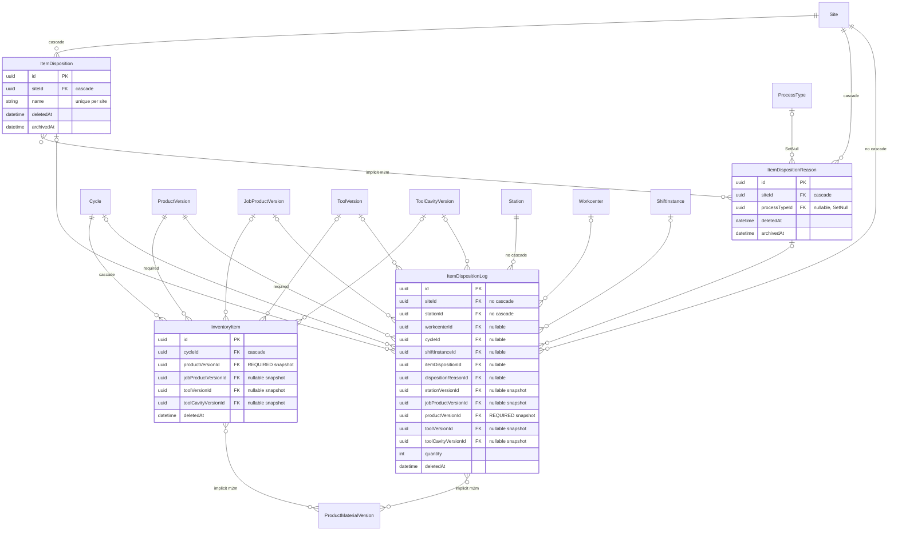
```mermaid
erDiagram
  InventoryItem {
    uuid id PK
    uuid cycleId FK "cascade"
    uuid productVersionId FK "REQUIRED snapshot"
    uuid jobProductVersionId FK "nullable snapshot"
    uuid toolVersionId FK "nullable snapshot"
    uuid toolCavityVersionId FK "nullable snapshot"
    datetime deletedAt
  }
  ItemDisposition {
    uuid id PK
    uuid siteId FK "cascade"
    string name "unique per site"
    datetime deletedAt
    datetime archivedAt
  }
  ItemDispositionReason {
    uuid id PK
    uuid siteId FK "cascade"
    uuid processTypeId FK "nullable, SetNull"
    datetime deletedAt
    datetime archivedAt
  }
  ItemDispositionLog {
    uuid id PK
    uuid siteId FK "no cascade"
    uuid stationId FK "no cascade"
    uuid workcenterId FK "nullable"
    uuid cycleId FK "nullable"
    uuid shiftInstanceId FK "nullable"
    uuid itemDispositionId FK "nullable"
    uuid dispositionReasonId FK "nullable"
    uuid stationVersionId FK "nullable snapshot"
    uuid jobProductVersionId FK "nullable snapshot"
    uuid productVersionId FK "REQUIRED snapshot"
    uuid toolVersionId FK "nullable snapshot"
    uuid toolCavityVersionId FK "nullable snapshot"
    int quantity
    datetime deletedAt
  }

  Cycle ||--o{ InventoryItem : "cascade"
  ProductVersion ||--o{ InventoryItem : "required"
  JobProductVersion |o--o{ InventoryItem : ""
  ToolVersion |o--o{ InventoryItem : ""
  ToolCavityVersion |o--o{ InventoryItem : ""
  InventoryItem }o--o{ ProductMaterialVersion : "implicit m2m"
  Site ||--o{ ItemDisposition : "cascade"
  Site ||--o{ ItemDispositionReason : "cascade"
  ProcessType |o--o{ ItemDispositionReason : "SetNull"
  ItemDisposition }o--o{ ItemDispositionReason : "implicit m2m"
  Site ||--o{ ItemDispositionLog : "no cascade"
  Station ||--o{ ItemDispositionLog : "no cascade"
  Workcenter |o--o{ ItemDispositionLog : ""
  Cycle |o--o{ ItemDispositionLog : ""
  ShiftInstance |o--o{ ItemDispositionLog : ""
  ItemDisposition |o--o{ ItemDispositionLog : ""
  ItemDispositionReason |o--o{ ItemDispositionLog : ""
  ProductVersion ||--o{ ItemDispositionLog : "required"
  JobProductVersion |o--o{ ItemDispositionLog : ""
  ToolVersion |o--o{ ItemDispositionLog : ""
  ToolCavityVersion |o--o{ ItemDispositionLog : ""
  ItemDispositionLog }o--o{ ProductMaterialVersion : "implicit m2m"
```

### Material ledger

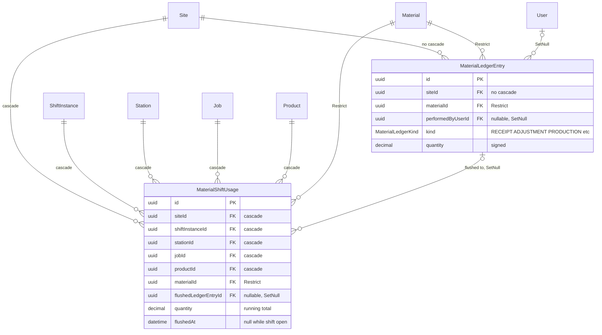
```mermaid
erDiagram
  MaterialLedgerEntry {
    uuid id PK
    uuid siteId FK "no cascade"
    uuid materialId FK "Restrict"
    uuid performedByUserId FK "nullable, SetNull"
    MaterialLedgerKind kind "RECEIPT ADJUSTMENT PRODUCTION etc"
    decimal quantity "signed"
  }
  MaterialShiftUsage {
    uuid id PK
    uuid siteId FK "cascade"
    uuid shiftInstanceId FK "cascade"
    uuid stationId FK "cascade"
    uuid jobId FK "cascade"
    uuid productId FK "cascade"
    uuid materialId FK "Restrict"
    uuid flushedLedgerEntryId FK "nullable, SetNull"
    decimal quantity "running total"
    datetime flushedAt "null while shift open"
  }

  Site ||--o{ MaterialLedgerEntry : "no cascade"
  Material ||--o{ MaterialLedgerEntry : "Restrict"
  User |o--o{ MaterialLedgerEntry : "SetNull"
  Site ||--o{ MaterialShiftUsage : "cascade"
  ShiftInstance ||--o{ MaterialShiftUsage : "cascade"
  Station ||--o{ MaterialShiftUsage : "cascade"
  Job ||--o{ MaterialShiftUsage : "cascade"
  Product ||--o{ MaterialShiftUsage : "cascade"
  Material ||--o{ MaterialShiftUsage : "Restrict"
  MaterialLedgerEntry |o--o{ MaterialShiftUsage : "flushed to, SetNull"
```

- The ledger is append-only except `PRODUCTION` rows, which mutate during an open shift via the `MaterialShiftUsage` staging binding, then freeze at flush.

## Shifts

Source: `packages/db/schema/shift.prisma`.

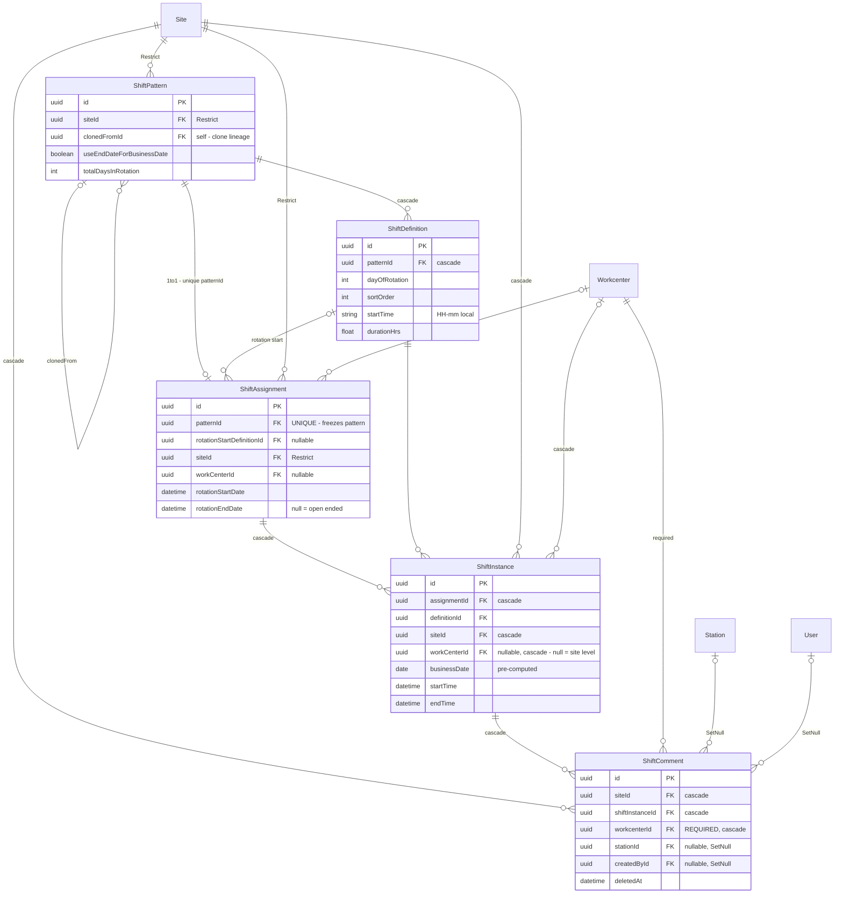
```mermaid
erDiagram
  ShiftPattern {
    uuid id PK
    uuid siteId FK "Restrict"
    uuid clonedFromId FK "self - clone lineage"
    boolean useEndDateForBusinessDate
    int totalDaysInRotation
  }
  ShiftDefinition {
    uuid id PK
    uuid patternId FK "cascade"
    int dayOfRotation
    int sortOrder
    string startTime "HH-mm local"
    float durationHrs
  }
  ShiftAssignment {
    uuid id PK
    uuid patternId FK "UNIQUE - freezes pattern"
    uuid rotationStartDefinitionId FK "nullable"
    uuid siteId FK "Restrict"
    uuid workCenterId FK "nullable"
    datetime rotationStartDate
    datetime rotationEndDate "null = open ended"
  }
  ShiftInstance {
    uuid id PK
    uuid assignmentId FK "cascade"
    uuid definitionId FK
    uuid siteId FK "cascade"
    uuid workCenterId FK "nullable, cascade - null = site level"
    date businessDate "pre-computed"
    datetime startTime
    datetime endTime
  }
  ShiftComment {
    uuid id PK
    uuid siteId FK "cascade"
    uuid shiftInstanceId FK "cascade"
    uuid workcenterId FK "REQUIRED, cascade"
    uuid stationId FK "nullable, SetNull"
    uuid createdById FK "nullable, SetNull"
    datetime deletedAt
  }

  Site ||--o{ ShiftPattern : "Restrict"
  ShiftPattern |o--o{ ShiftPattern : "clonedFrom"
  ShiftPattern ||--o{ ShiftDefinition : "cascade"
  ShiftPattern ||--o| ShiftAssignment : "1to1 - unique patternId"
  ShiftDefinition |o--o{ ShiftAssignment : "rotation start"
  Site ||--o{ ShiftAssignment : "Restrict"
  Workcenter |o--o{ ShiftAssignment : ""
  ShiftAssignment ||--o{ ShiftInstance : "cascade"
  ShiftDefinition ||--o{ ShiftInstance : ""
  Site ||--o{ ShiftInstance : "cascade"
  Workcenter |o--o{ ShiftInstance : "cascade"
  Site ||--o{ ShiftComment : "cascade"
  ShiftInstance ||--o{ ShiftComment : "cascade"
  Workcenter ||--o{ ShiftComment : "required"
  Station |o--o{ ShiftComment : "SetNull"
  User |o--o{ ShiftComment : "SetNull"
```

- A pattern is frozen once assigned (`ShiftAssignment.patternId @unique`); changes go through clone → assign, with `clonedFromId` tracking lineage.
- `ShiftComment.workcenterId` is required even though `stationId` exists — a site-level comment is impossible by schema.

## Metrics

Source: `packages/db/schema/metric.prisma`. `MetricBucketLog` is an identical archive twin (plus `archivedAt`) with the same soft references — omitted from the diagram for brevity.

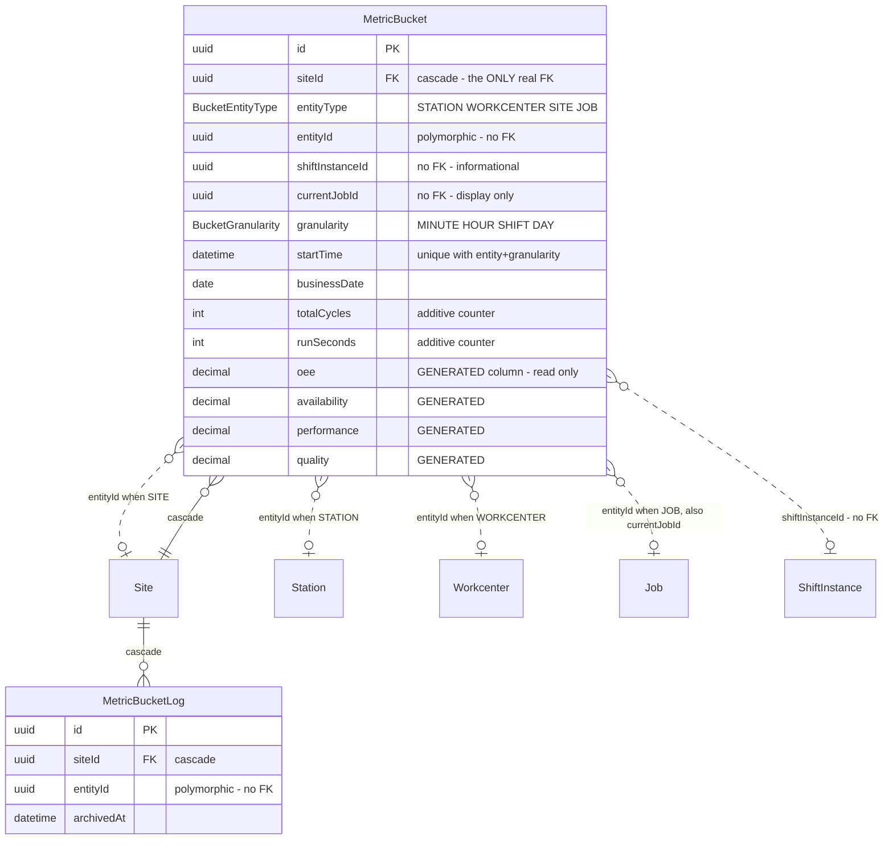
```mermaid
erDiagram
  MetricBucket {
    uuid id PK
    uuid siteId FK "cascade - the ONLY real FK"
    BucketEntityType entityType "STATION WORKCENTER SITE JOB"
    uuid entityId "polymorphic - no FK"
    uuid shiftInstanceId "no FK - informational"
    uuid currentJobId "no FK - display only"
    BucketGranularity granularity "MINUTE HOUR SHIFT DAY"
    datetime startTime "unique with entity+granularity"
    date businessDate
    int totalCycles "additive counter"
    int runSeconds "additive counter"
    decimal oee "GENERATED column - read only"
    decimal availability "GENERATED"
    decimal performance "GENERATED"
    decimal quality "GENERATED"
  }
  MetricBucketLog {
    uuid id PK
    uuid siteId FK "cascade"
    uuid entityId "polymorphic - no FK"
    datetime archivedAt
  }

  Site ||--o{ MetricBucket : "cascade"
  Site ||--o{ MetricBucketLog : "cascade"
  MetricBucket }o..o| Station : "entityId when STATION"
  MetricBucket }o..o| Workcenter : "entityId when WORKCENTER"
  MetricBucket }o..o| Site : "entityId when SITE"
  MetricBucket }o..o| Job : "entityId when JOB, also currentJobId"
  MetricBucket }o..o| ShiftInstance : "shiftInstanceId - no FK"
```

- `entityId`, `shiftInstanceId`, and `currentJobId` are all unconstrained. Deleting a Station leaves its buckets pointing at nothing; consumers must treat these as best-effort labels (`entityName`, `path`, `currentJobName` are denormalized alongside for that reason).
- The OEE ratio columns are Postgres `GENERATED ALWAYS AS` — app writes are forbidden; formulas live in the migrations.

## Graph (LiveStore configuration)

Source: `packages/db/schema/graph.prisma`. These tables are the *definitions* for the in-house reactive graph engine; computed values never touch Postgres.

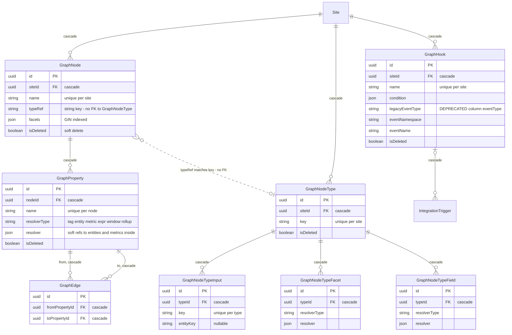
```mermaid
erDiagram
  GraphNode {
    uuid id PK
    uuid siteId FK "cascade"
    string name "unique per site"
    string typeRef "string key - no FK to GraphNodeType"
    json facets "GIN indexed"
    boolean isDeleted "soft delete"
  }
  GraphProperty {
    uuid id PK
    uuid nodeId FK "cascade"
    string name "unique per node"
    string resolverType "tag entity metric expr window rollup"
    json resolver "soft refs to entities and metrics inside"
    boolean isDeleted
  }
  GraphEdge {
    uuid id PK
    uuid fromPropertyId FK "cascade"
    uuid toPropertyId FK "cascade"
  }
  GraphNodeType {
    uuid id PK
    uuid siteId FK "cascade"
    string key "unique per site"
    boolean isDeleted
  }
  GraphNodeTypeInput {
    uuid id PK
    uuid typeId FK "cascade"
    string key "unique per type"
    string entityKey "nullable"
  }
  GraphNodeTypeFacet {
    uuid id PK
    uuid typeId FK "cascade"
    string resolverType
    json resolver
  }
  GraphNodeTypeField {
    uuid id PK
    uuid typeId FK "cascade"
    string resolverType
    json resolver
  }
  GraphHook {
    uuid id PK
    uuid siteId FK "cascade"
    string name "unique per site"
    json condition
    string legacyEventType "DEPRECATED column eventType"
    string eventNamespace
    string eventName
    boolean isDeleted
  }

  Site ||--o{ GraphNode : "cascade"
  Site ||--o{ GraphNodeType : "cascade"
  Site ||--o{ GraphHook : "cascade"
  GraphNode ||--o{ GraphProperty : "cascade"
  GraphProperty ||--o{ GraphEdge : "from, cascade"
  GraphProperty ||--o{ GraphEdge : "to, cascade"
  GraphNodeType ||--o{ GraphNodeTypeInput : "cascade"
  GraphNodeType ||--o{ GraphNodeTypeFacet : "cascade"
  GraphNodeType ||--o{ GraphNodeTypeField : "cascade"
  GraphNode }o..o| GraphNodeType : "typeRef matches key - no FK"
  GraphHook |o--o{ IntegrationTrigger : "cascade"
```

Cross-store relationships (not FK-enforceable):

- Every `GraphProperty` row has a **1:1 value envelope** in the NATS KV bucket `cvg` (key `prop.<propertyId>`); `window` properties additionally hold state in KV `imm_agg_state` (key `agg.<propertyId>`). Neither is garbage-collected by the database.
- `GraphProperty.resolver` JSON contains soft references *into* the relational model: `entity` resolvers carry `{entityType, entityId}`, `metric` resolvers address MetricBucket columns, `tag` resolvers address `Datasource`/`Point` paths. Validated by zod (`packages/livestore/src/catalog/resolver-schemas.ts`), never by the database.

## User-defined entities (EAV / JSONB)

Source: `packages/db/schema/entity.prisma`.

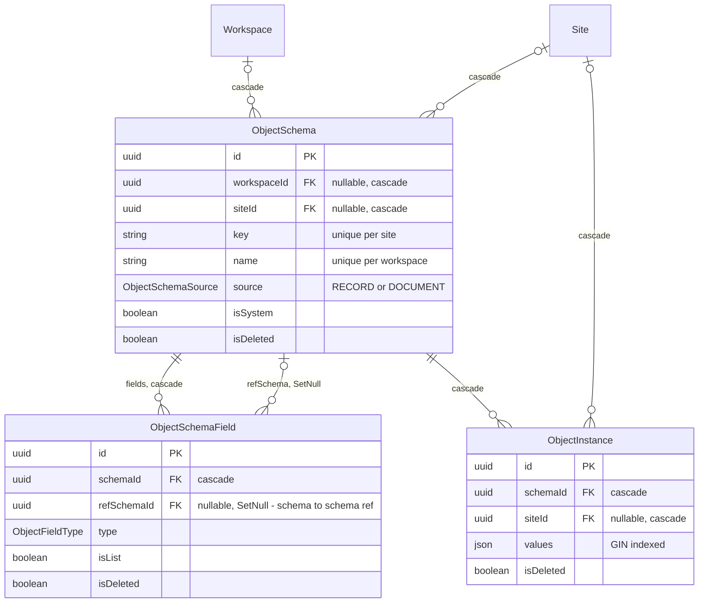
```mermaid
erDiagram
  ObjectSchema {
    uuid id PK
    uuid workspaceId FK "nullable, cascade"
    uuid siteId FK "nullable, cascade"
    string key "unique per site"
    string name "unique per workspace"
    ObjectSchemaSource source "RECORD or DOCUMENT"
    boolean isSystem
    boolean isDeleted
  }
  ObjectSchemaField {
    uuid id PK
    uuid schemaId FK "cascade"
    uuid refSchemaId FK "nullable, SetNull - schema to schema ref"
    ObjectFieldType type
    boolean isList
    boolean isDeleted
  }
  ObjectInstance {
    uuid id PK
    uuid schemaId FK "cascade"
    uuid siteId FK "nullable, cascade"
    json values "GIN indexed"
    boolean isDeleted
  }

  Workspace |o--o{ ObjectSchema : "cascade"
  Site |o--o{ ObjectSchema : "cascade"
  ObjectSchema ||--o{ ObjectSchemaField : "fields, cascade"
  ObjectSchema |o--o{ ObjectSchemaField : "refSchema, SetNull"
  ObjectSchema ||--o{ ObjectInstance : "cascade"
  Site |o--o{ ObjectInstance : "cascade"
```

- Both scope FKs are nullable — a schema can be workspace-scoped, site-scoped, or (by schema at least) neither. `ObjectSchemaField.refSchemaId` makes the meta-model self-referencing: fields can point at other object schemas.

## Edge & devices

Source: `packages/db/schema/gateway.prisma`, `datasource.prisma`.

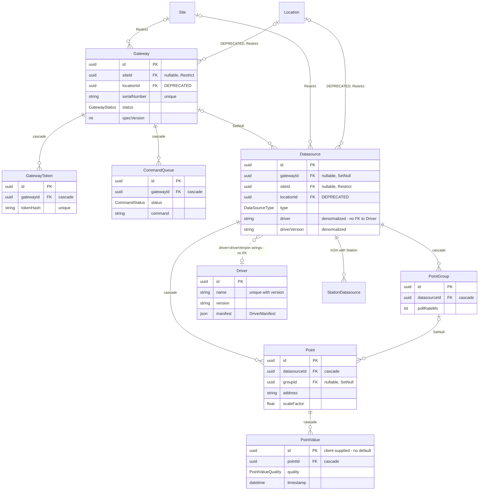
```mermaid
erDiagram
  Gateway {
    uuid id PK
    uuid siteId FK "nullable, Restrict"
    uuid locationId FK "DEPRECATED"
    string serialNumber "unique"
    GatewayStatus status
    int specVersion
  }
  GatewayToken {
    uuid id PK
    uuid gatewayId FK "cascade"
    string tokenHash "unique"
  }
  CommandQueue {
    uuid id PK
    uuid gatewayId FK "cascade"
    CommandStatus status
    string command
  }
  Datasource {
    uuid id PK
    uuid gatewayId FK "nullable, SetNull"
    uuid siteId FK "nullable, Restrict"
    uuid locationId FK "DEPRECATED"
    DataSourceType type
    string driver "denormalized - no FK to Driver"
    string driverVersion "denormalized"
  }
  PointGroup {
    uuid id PK
    uuid datasourceId FK "cascade"
    int pollRateMs
  }
  Point {
    uuid id PK
    uuid datasourceId FK "cascade"
    uuid groupId FK "nullable, SetNull"
    string address
    float scaleFactor
  }
  PointValue {
    uuid id PK "client-supplied - no default"
    uuid pointId FK "cascade"
    PointValueQuality quality
    datetime timestamp
  }
  Driver {
    uuid id PK
    string name "unique with version"
    string version
    json manifest "DriverManifest"
  }

  Site |o--o{ Gateway : "Restrict"
  Location |o--o{ Gateway : "DEPRECATED, Restrict"
  Gateway ||--o{ GatewayToken : "cascade"
  Gateway ||--o{ CommandQueue : "cascade"
  Gateway |o--o{ Datasource : "SetNull"
  Site |o--o{ Datasource : "Restrict"
  Location |o--o{ Datasource : "DEPRECATED, Restrict"
  Datasource ||--o{ PointGroup : "cascade"
  Datasource ||--o{ Point : "cascade"
  PointGroup |o--o{ Point : "SetNull"
  Point ||--o{ PointValue : "cascade"
  Datasource }o..o| Driver : "driver+driverVersion strings - no FK"
  Datasource ||--o{ StationDatasource : "m2m with Station"
```

- `Datasource.driver`/`driverVersion` are a deliberate denormalized snapshot, but nothing ties them back to the `Driver` catalog — a driver row can be deleted or re-versioned without any constraint firing.
- `PointValue` is the high-volume time-series table; its Cascade means deleting a `Point` synchronously deletes its entire history.

## Employees & operators

Source: `packages/db/schema/employee.prisma`.

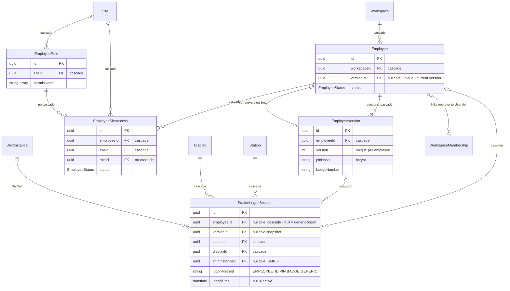
```mermaid
erDiagram
  Employee {
    uuid id PK
    uuid workspaceId FK "cascade"
    uuid versionId FK "nullable, unique - current version"
    EmployeeStatus status
  }
  EmployeeVersion {
    uuid id PK
    uuid employeeId FK "cascade"
    int version "unique per employee"
    string pinHash "bcrypt"
    string badgeNumber
  }
  EmployeeRole {
    uuid id PK
    uuid siteId FK "cascade"
    string-array permissions
  }
  EmployeeSiteAccess {
    uuid id PK
    uuid employeeId FK "cascade"
    uuid siteId FK "cascade"
    uuid roleId FK "no cascade"
    EmployeeStatus status
  }
  StationLogonSession {
    uuid id PK
    uuid employeeId FK "nullable, cascade - null = generic logon"
    uuid versionId FK "nullable snapshot"
    uuid stationId FK "cascade"
    uuid displayId FK "cascade"
    uuid shiftInstanceId FK "nullable, SetNull"
    string logonMethod "EMPLOYEE_ID PIN BADGE GENERIC"
    datetime logoffTime "null = active"
  }

  Workspace ||--o{ Employee : "cascade"
  EmployeeVersion |o--o| Employee : "currentVersion 1to1"
  Employee ||--o{ EmployeeVersion : "versions, cascade"
  Site ||--o{ EmployeeRole : "cascade"
  Employee ||--o{ EmployeeSiteAccess : "cascade"
  Site ||--o{ EmployeeSiteAccess : "cascade"
  EmployeeRole ||--o{ EmployeeSiteAccess : "no cascade"
  Employee |o--o{ StationLogonSession : "cascade"
  EmployeeVersion |o--o{ StationLogonSession : "snapshot"
  Station ||--o{ StationLogonSession : "cascade"
  Display ||--o{ StationLogonSession : "cascade"
  ShiftInstance |o--o{ StationLogonSession : "SetNull"
  Employee |o--o{ WorkspaceMembership : "links operator to User tier"
```

- `logonMethod` is a plain string, not an enum — the allowed values live only in code.

## Presentation

Source: `packages/db/schema/dashboard.prisma`, `display.prisma`, `andon.prisma`, `saved-view.prisma`, `document.prisma`.

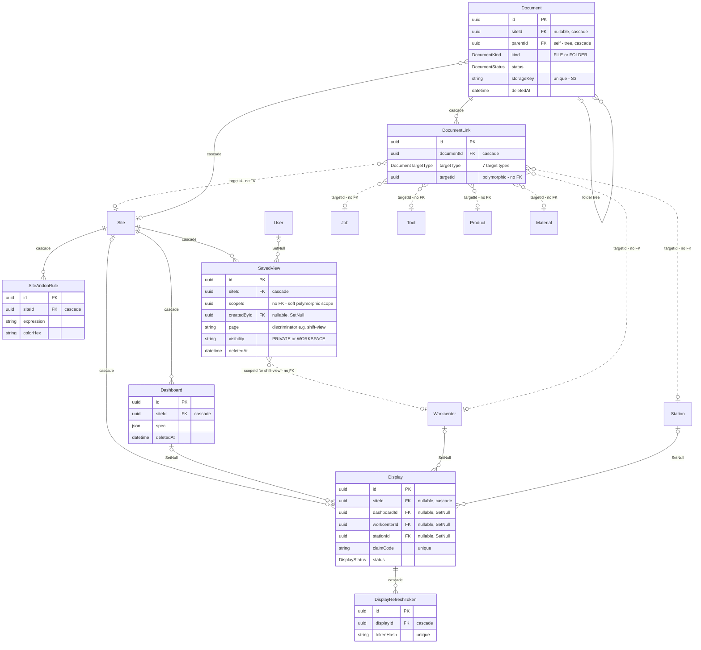
```mermaid
erDiagram
  Dashboard {
    uuid id PK
    uuid siteId FK "cascade"
    json spec
    datetime deletedAt
  }
  Display {
    uuid id PK
    uuid siteId FK "nullable, cascade"
    uuid dashboardId FK "nullable, SetNull"
    uuid workcenterId FK "nullable, SetNull"
    uuid stationId FK "nullable, SetNull"
    string claimCode "unique"
    DisplayStatus status
  }
  DisplayRefreshToken {
    uuid id PK
    uuid displayId FK "cascade"
    string tokenHash "unique"
  }
  SiteAndonRule {
    uuid id PK
    uuid siteId FK "cascade"
    string expression
    string colorHex
  }
  SavedView {
    uuid id PK
    uuid siteId FK "cascade"
    uuid scopeId "no FK - soft polymorphic scope"
    uuid createdById FK "nullable, SetNull"
    string page "discriminator e.g. shift-view"
    string visibility "PRIVATE or WORKSPACE"
    datetime deletedAt
  }
  Document {
    uuid id PK
    uuid siteId FK "nullable, cascade"
    uuid parentId FK "self - tree, cascade"
    DocumentKind kind "FILE or FOLDER"
    DocumentStatus status
    string storageKey "unique - S3"
    datetime deletedAt
  }
  DocumentLink {
    uuid id PK
    uuid documentId FK "cascade"
    DocumentTargetType targetType "7 target types"
    uuid targetId "polymorphic - no FK"
  }

  Site ||--o{ Dashboard : "cascade"
  Site |o--o{ Display : "cascade"
  Dashboard |o--o{ Display : "SetNull"
  Workcenter |o--o{ Display : "SetNull"
  Station |o--o{ Display : "SetNull"
  Display ||--o{ DisplayRefreshToken : "cascade"
  Site ||--o{ SiteAndonRule : "cascade"
  Site ||--o{ SavedView : "cascade"
  User |o--o{ SavedView : "SetNull"
  SavedView }o..o| Workcenter : "scopeId for shift-view - no FK"
  Site |o--o{ Document : "cascade"
  Document |o--o{ Document : "folder tree"
  Document ||--o{ DocumentLink : "cascade"
  DocumentLink }o..o| Site : "targetId - no FK"
  DocumentLink }o..o| Workcenter : "targetId - no FK"
  DocumentLink }o..o| Station : "targetId - no FK"
  DocumentLink }o..o| Job : "targetId - no FK"
  DocumentLink }o..o| Tool : "targetId - no FK"
  DocumentLink }o..o| Product : "targetId - no FK"
  DocumentLink }o..o| Material : "targetId - no FK"
```

- `DocumentLink.targetId` fans out to seven target types (SITE, WORKCENTER, STATION, JOB, TOOL, PRODUCT, MATERIAL) — all unconstrained. Deleting any target silently orphans its links.
- `SavedView.visibility` is a string, not an enum, and `scopeId` is documented as "no polymorphic FK — scoped queries simply never request orphaned rows."

## Integrations & Automations

Source: `packages/db/schema/integration.prisma`, `automation.prisma`.

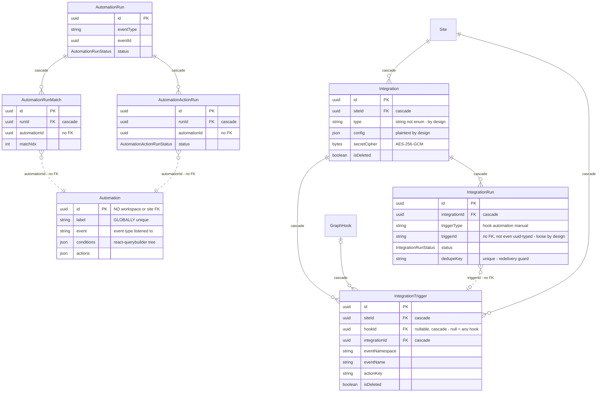
```mermaid
erDiagram
  Integration {
    uuid id PK
    uuid siteId FK "cascade"
    string type "string not enum - by design"
    json config "plaintext by design"
    bytes secretCipher "AES-256-GCM"
    boolean isDeleted
  }
  IntegrationTrigger {
    uuid id PK
    uuid siteId FK "cascade"
    uuid hookId FK "nullable, cascade - null = any hook"
    uuid integrationId FK "cascade"
    string eventNamespace
    string eventName
    string actionKey
    boolean isDeleted
  }
  IntegrationRun {
    uuid id PK
    uuid integrationId FK "cascade"
    string triggerType "hook automation manual"
    string triggerId "no FK, not even uuid-typed - loose by design"
    IntegrationRunStatus status
    string dedupeKey "unique - redelivery guard"
  }
  Automation {
    uuid id PK "NO workspace or site FK"
    string label "GLOBALLY unique"
    string event "event type listened to"
    json conditions "react-querybuilder tree"
    json actions
  }
  AutomationRun {
    uuid id PK
    string eventType
    uuid eventId
    AutomationRunStatus status
  }
  AutomationRunMatch {
    uuid id PK
    uuid runId FK "cascade"
    uuid automationId "no FK"
    int matchIdx
  }
  AutomationActionRun {
    uuid id PK
    uuid runId FK "cascade"
    uuid automationId "no FK"
    AutomationActionRunStatus status
  }

  Site ||--o{ Integration : "cascade"
  Site ||--o{ IntegrationTrigger : "cascade"
  GraphHook |o--o{ IntegrationTrigger : "cascade"
  Integration ||--o{ IntegrationTrigger : "cascade"
  Integration ||--o{ IntegrationRun : "cascade"
  IntegrationRun }o..o| IntegrationTrigger : "triggerId - no FK"
  AutomationRun ||--o{ AutomationRunMatch : "cascade"
  AutomationRun ||--o{ AutomationActionRun : "cascade"
  AutomationRunMatch }o..|| Automation : "automationId - no FK"
  AutomationActionRun }o..|| Automation : "automationId - no FK"
```

- `Automation` is scoped to **neither workspace nor site** — the only user-authored entity with no tenant boundary in the schema. Fine while deployments are single-tenant, but a trap if that ever changes.
- The run tables keep loose `automationId`/`triggerId` ids so history survives deletion — the same deliberate-orphan pattern as `AuditLog`.

## Implicit many-to-many join tables

Prisma generates these; migrations renamed `*Blob` → `*Version` (`20260710120000_rename_blob_to_version`).

| Join table | Between |
| --- | --- |
| `_StationToStationClassification` | Station ↔ StationClassification |
| `_ToolToToolClassification` | Tool ↔ ToolClassification |
| `_ProcessTypeToStatusReason` | ProcessType ↔ StatusReason |
| `_StatusReasonToWorkcenter` | StatusReason ↔ Workcenter |
| `_StationToStatusReason` | Station ↔ StatusReason |
| `_DispositionReasonDispositions` | ItemDisposition ↔ ItemDispositionReason |
| `_CycleToToolVersion` | Cycle ↔ ToolVersion |
| `_CycleToJobTool` | Cycle ↔ JobTool |
| `_InventoryItemToProductMaterialVersion` | InventoryItem ↔ ProductMaterialVersion |
| `_ItemDispositionLogToProductMaterialVersion` | ItemDispositionLog ↔ ProductMaterialVersion |

## Audit findings

Concerns collected while mapping the schema, ordered roughly by risk. Items marked *(by design)* are documented intent that still deserves a periodic look.

### 1. Unconstrained (no-FK) references

Every dashed line above. Nothing prevents dangling ids; each consumer must handle orphans.

| Column(s) | Points at | Notes |
| --- | --- | --- |
| `MetricBucket.entityId` / `MetricBucketLog.entityId` | Station \| Workcenter \| Site \| Job | Polymorphic on `entityType`; denormalized `entityName`/`path` compensate |
| `MetricBucket.shiftInstanceId`, `.currentJobId` | ShiftInstance, Job | Explicitly "purely informational" |
| `DocumentLink.targetId` | 7 entity types | Orphaned on target delete |
| `SavedView.scopeId` | page-dependent (Workcenter for shift-view) | *(by design)* |
| `AuditLog.userId` / `.actorId` / `.workspaceId` | User, Workspace | *(by design — survives deletion)* |
| `IntegrationRun.triggerId` | IntegrationTrigger \| Automation \| manual | *(by design)* |
| `AutomationRunMatch.automationId`, `AutomationActionRun.automationId` | Automation | *(by design)* |
| `StationJobLog.jobVersionId` | JobVersion | **Required column with no FK** — worst of both worlds |
| `GraphNode.typeRef` | `GraphNodeType.key` | String key, no FK |
| `GraphProperty.resolver` (JSON) | any entity / MetricBucket / Point path | zod-validated only |
| `Datasource.driver` + `.driverVersion` | `Driver` catalog | Denormalized snapshot, catalog unenforced |

**Suggested review:** for each row, decide FK vs. documented-orphan policy; `StationJobLog.jobVersionId` should almost certainly become a real FK.

### 2. Inconsistent `onDelete` on `siteId` — Site is effectively undeletable

Site children mix three behaviors: **Cascade** (Workcenter, Station, Graph\*, Metric\*, Dashboard, Document, Integration, …), **Restrict** (Gateway, Datasource, ShiftPattern, ShiftAssignment), and **default NoAction** (Cycle, Job, Tool, Product, Material, WorkOrder, Order, ItemDispositionLog, MaterialLedgerEntry). Deleting a Site with any production history fails mid-graph, after some cascades would have fired had the transaction not rolled back. Either everything cascades, or Site deletion should be soft-only and the mixed actions documented.

### 3. Three coexisting soft-delete conventions

- `deletedAt DateTime?` — operational entities (Cycle, Station, Customer, Document, SavedView, …)
- `archivedAt DateTime?` — versioned catalog entities (Job, Tool, Product, Material, ProcessType, StatusReason, ToolStatus, ItemDisposition\*, ProductMaterial); several carry **both** `deletedAt` and `archivedAt` with distinct meanings
- `isDeleted Boolean` — Graph\*, Object\*, Integration\*

No global middleware enforces filtering; every query must remember. See the standing `docs/notes/soft-delete-audit.md` for the per-callsite audit.

### 4. Circular current-version 1:1 pattern (×9)

Station, Job, Tool, ToolCavity, Product, Material, ProductMaterial, JobProduct, and Employee each hold `currentVersionId? @unique` → their `*Version` table, while the version table holds a required FK back to the parent. Consequences: two-step inserts (create parent → create version → set pointer), and neither row can be hard-deleted without ordering care. Consistent — but worth confirming every write path sets the pointer atomically.

### 5. Two unrelated "order" concepts

`WorkOrder` (`workorder.prisma`, production; `Cycle.orderId` → **WorkOrder**) vs. `Order`/`OrderLineItem`/`OrderInventoryAllocation` (`inventory.prisma`, fulfillment). Both use `orderNumber` unique-per-site. Nothing links a WorkOrder to the fulfillment Order it serves; if that relationship exists operationally, it's currently implicit.

### 6. Tenancy scoping inconsistencies

Most entities scope by `siteId` with workspace implicit. Direct `workspaceId` scoping: User-tier IAM (Role, ApiToken), Employee, ObjectSchema (either scope, both nullable). **`Automation` has neither** — globally-unique label, no tenant column. `ObjectSchema` rows with both scopes null are representable.

### 7. Snapshot-column nullability inconsistencies

`Cycle.jobVersionId` required vs. `Cycle.stationVersionId` optional; `InventoryItem.productVersionId` and `ItemDispositionLog.productVersionId` required vs. all sibling version snapshots optional. If the rule is "snapshot what existed at event time," the required/optional split should be deliberate and documented, not incidental.

### 8. Deprecated-but-present schema

`Location` model + `LocationType` enum; `Gateway.locationId`, `Datasource.locationId`; `User.firstName`/`lastName`; `GraphHook.legacyEventType` (mapped to column `eventType`). Each carries real FK constraints (Location's are `Restrict` — a Location referenced by a Gateway can't be deleted). Worth a removal milestone.

### 9. Parallel hand-maintained schema: `SYSTEM_ENTITY_REGISTRY`

`packages/services/src/entity/registry.ts` re-declares the graph-addressable subset of this model (field paths like `currentVersion.standardCycle`, virtual fields like `status` / `lastCycleSeconds` that have no column). It can silently drift from the Prisma schema — any schema change to the 14 system entity types needs a matching registry change, enforced only by convention.

### 10. Cross-store orphans: GraphProperty ↔ NATS KV

Each `GraphProperty` has a value envelope in KV `cvg` (and window props in `imm_agg_state`). Deleting properties (or cascading a GraphNode/Site delete) does not clean KV entries — the stores diverge unless the engine's reconcile handles it.

### 11. Enum-shaped strings

`StationLogonSession.logonMethod`, `SavedView.visibility`, `IntegrationRun.triggerType`, `GraphProperty.resolverType` and the `valueType`/`resolverType` columns on the `GraphNodeTypeInput`/`Facet`/`Field` tables are free strings whose domains live in code. Some are deliberate (Integration.type documents why); the rest silently accept typos.

### 12. High-volume table risks

`PointValue`: client-supplied PK (no default) and `onDelete: Cascade` from Point — deleting one Point synchronously deletes its full history inside the transaction. `MetricBucket`/`MetricBucketLog` and `StationStateLog` are also unbounded-growth tables; archival exists for buckets, nothing prunes `PointValue` or `StationStateLog` at the schema level.
