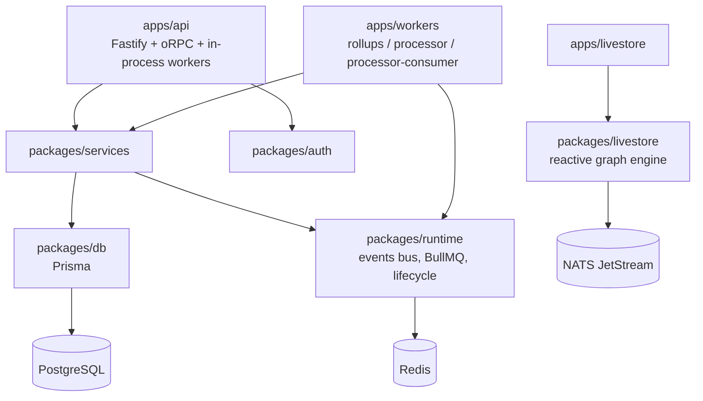

# Architecture Patterns

Write-ups of the system's structure and the recurring patterns implemented across apps and packages. One page per pattern — add new pages here and register them in the sidebar (see [How to Write Docs](../contributing)).

## System overview

## Patterns

_No pattern write-ups yet. Good candidates: the events bus (Redis pub/sub bridge), worker startup composition in `apps/workers`, per-principal JWT keys, the livestore reactive graph._
