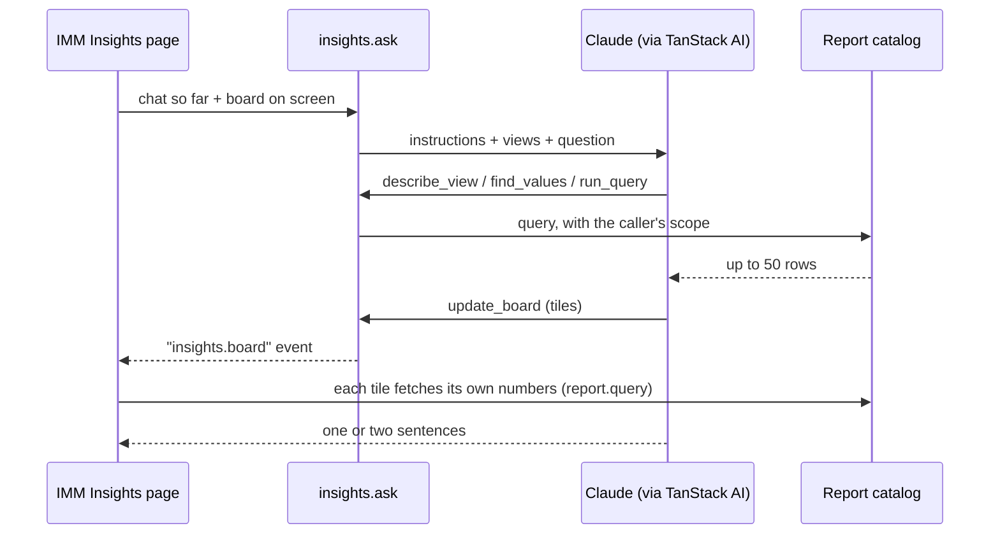

# Insights

Insights lets people ask about the plant in plain words, like "What was OEE by press last week?" The AI answers with a **board**: a few tiles on screen. A tile can be a chart or table, a row of big numbers, or a short note.

Each chart tile is a normal report. You can open it in the report explorer, change it by hand, and save it. The AI is the quick way in. The explorer is how you fine-tune.

## The report catalog

Everything starts with the report catalog in `packages/services/src/reporting/`. It is a list of what can be counted and how. It borrows ideas from Cube.

| Word | What it means | Example |
|---|---|---|
| Fact | A table of things that happened | `cycles`, `statePeriods` (downtime), `production` |
| Measure | A number you can add up, or a rate made from two such numbers | `downSeconds`, `oee`, `scrapRate` |
| Dimension | A way to split the numbers | `station`, `workcenter`, `businessDate` |
| Segment | A ready-made filter with a name | `unplannedDown`, `open` calls |
| View | A topic for people and the AI: one fact, with only the useful measures and dimensions | `oee`, `downtime`, `scrap` |

A few rules keep the numbers right:

- Rates like OEE are worked out from the totals behind them, never by averaging rates.
- Some measures must be split by a dimension. Material quantity must be split by `unit`, because kilograms and pounds can't be added together. The server refuses a query that breaks this.
- All SQL is written in the catalog. People and the AI only ever pick names from it.
- Every query only sees the caller's own site, and only the lines (workcenters) they are allowed to see.
- A report query stops after 15 seconds (`REPORT_STATEMENT_TIMEOUT_MS`) and says so, instead of tying up the database.

The words that describe each item (descriptions, other names, tips for the AI) are in `catalog-text.ts`. `facts.ts` holds only the SQL. The views are in `views.ts`.

## How a question is answered



The AI has five tools (`packages/services/src/insights/tools.ts`):

- `search_catalog`: find views, measures and dimensions by the words people use.
- `describe_view`: everything about one view.
- `find_values`: turn "press 12" into a station id.
- `run_query`: run a query and read up to 50 rows, to check the numbers.
- `update_board`: add, change or remove tiles. Bad tiles are sent back to the AI to fix. Good ones go to the page as an `insights.board` event.

The AI never types the numbers into a chart. Chart and figure tiles hold a report definition, and the page fetches the numbers itself with `report.query`. The page uses the same access rules, so what you see is exactly what the report explorer would show. The AI only writes numbers in text tiles, and it is told to use only numbers it read from `run_query`.

## Setup

Insights is off until the API has a key:

```sh
ANTHROPIC_API_KEY=...        # turns Insights on
INSIGHTS_MODEL=claude-opus-5 # optional
INSIGHTS_EFFORT=high         # optional: low, medium, high, max
```

`insights.status` tells the page whether Insights is on.

## Limits

- 30 questions per person every 10 minutes (kept in memory, per API server).
- 12 tool rounds per question, 12 tiles per board.
- The chat is not stored. The page sends it with each question. Save a board to keep it (saved view page `board`).
